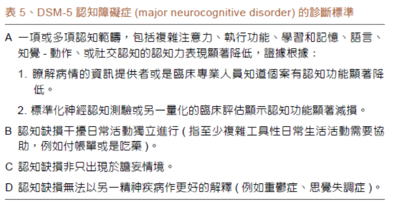

##### Major and minor Neurocognitive Disorders 主要和次要神經認知障礙
- 現在治療以越早介入越好，有一點徵兆就立即介入
- 認知功能如：
	- 複雜的注意力 Complex Attention: 
		- sustained, devided, selectiveattention, processing speed
	- 學習與記憶 Learning & Memory:
		- immediate, recent, long-term memory, free & cued recall,
	- 定向力 Orientation
		- 認知人、事、物、地
	- 動作 Praxis:
		- 視動visual-mortor, 知動perceptual-motor
	- 執行功能 Executive function:
		- planning, decision making, working emory,responding to feedback, error correction, overriding problem solving, habits/inhibition, mental flexibility
	- 判斷力 Judgment:
		- social cognition
	

